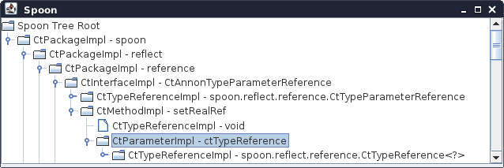

## Visualizing the Spoon AST of a Java file

To get started with the metamodel, you can browse the model (ie the Spoon AST) of a java file (say `MyClass.java`) as follows:

```
$ java -cp spoon-core-{{site.spoon_release}}-jar-with-dependencies.jar spoon.Launcher -i MyClass.java --gui
```



If you have Java 11 with Java FX, there is a new GUI, see <https://github.com/INRIA/spoon/tree/master/spoon-visualisation>


## Your first processor

In Spoon, a processor is a combination of query and analysis code.
With this concept, developer can analyse all elements of a type given 
and inspect each element of this type one per one.

For a first processor, we'll analyze all catch blocks of a `try {...} catch {...}` 
element to know how many empty catch blocks we have in a project. This kind of empty 
catch can be considered bad practice. That could be a great information to know how 
many and where are these catches in a project to fill them with some code, 
e.g. throws a runtime exception or logs the exception.

```java
// file processors/CatchProcessor.java
package processors;

import org.apache.log4j.Level;
import spoon.processing.AbstractProcessor;
import spoon.reflect.code.CtCatch;

/**
 * Reports warnings when empty catch blocks are found.
 */
public class CatchProcessor extends AbstractProcessor<CtCatch> {
	public void process(CtCatch element) {
		// we get all statements and if there isn't statement, it means the block catch is empty!
		if (element.getBody().getStatements().size() == 0) {
			getFactory().getEnvironment().report(this, Level.WARN, element, "empty catch clause");
		}
	}
}
```

This processor extends `AbstractProcessor` ([javadoc](http://spoon.gforge.inria.fr/mvnsites/spoon-core/apidocs/spoon/processing/AbstractProcessor.html)). 
This super class takes a generic type parameter to know what type you want inspect in a AST. 
For this tutorial, we inspect a catch, a `CtCatch` ([javadoc](http://spoon.gforge.inria.fr/mvnsites/spoon-core/apidocs/spoon/reflect/code/CtCatch.html)).

When the class `AbstractProcessor` ([javadoc](http://spoon.gforge.inria.fr/mvnsites/spoon-core/apidocs/spoon/processing/AbstractProcessor.html))
is extended, we implement the method `void process(E element)`where `E` is a generic type for 
any elements of the AST (all classes in the Spoon meta model which extends `CtElement` ([javadoc](http://spoon.gforge.inria.fr/mvnsites/spoon-core/apidocs/spoon/reflect/declaration/CtElement.html))). It is in this method that you can access all information you want of the the current `CtCatch` ([javadoc](http://spoon.gforge.inria.fr/mvnsites/spoon-core/apidocs/spoon/reflect/code/CtCatch.html)). 

## Apply the processor

First, compile your processor. You can use javac in command line to generate the `CatchProcessor.class` file. Then we execute Spoon as follows to analyze all catch blocks in Java files that are in `/path/to/src/of/your/project`:

```bash
$ java -classpath /path/to/binary/of/your/processor.jar:spoon-core-{{site.spoon_release}}-jar-with-dependencies.jar spoon.Launcher -i /path/to/src/of/your/project -p processors.CatchProcessor
```

{{site.data.alerts.important}} 
1. Specify all dependencies in your classpath. If your processor has dependencies, don't forget to package your processor.jar with all dependencies!
2. Specify your processors in fully qualified name (here `processors.CatchProcessor`).
{{site.data.alerts.end}}

There are many more examples of source code analysis in <https://github.com/SpoonLabs/spoon-examples>.

## Bytecode analysis

Note that spoon also supports the analysis of bytecode through decompilation. See [javadoc](http://spoon.gforge.inria.fr/mvnsites/spoon-core/apidocs/spoon/JarLauncher.html).
