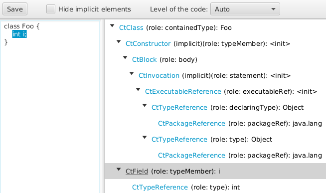
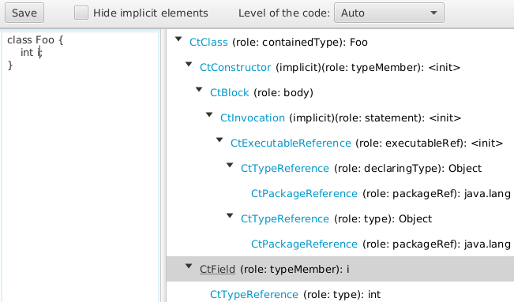
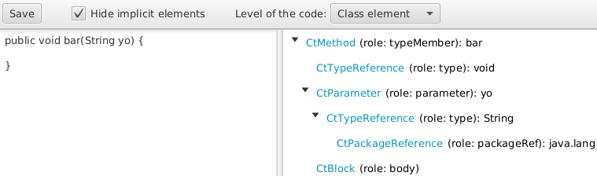
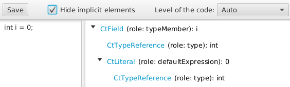
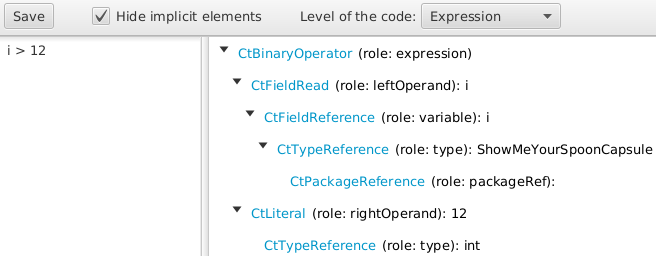
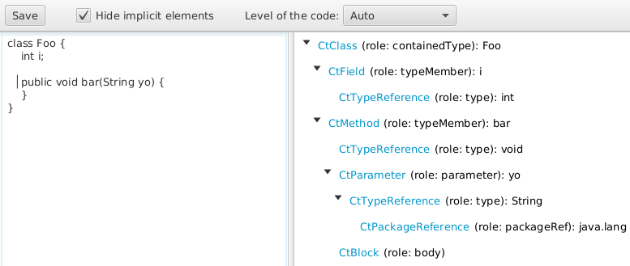
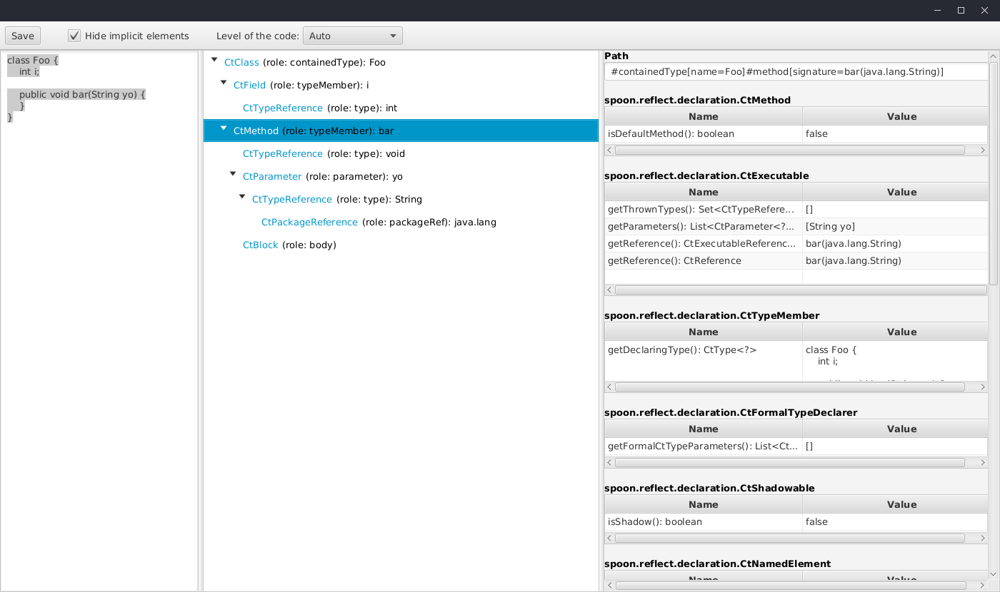

# Visualization of Spoon ASTs with JavaFX

A JavaFX app for visualising the Spoon abstract syntax tree of Java code (Java 11 supported).
It is an alternative to the Swing-based GUI of Spoon ASTs (`$ java -cp spoon...-jar-with-dependencies.jar spoon.Launcher -i class.java --gui --noclasspath`)

## Contributors

- @arnobl

## How to run

1. Install Java **22** or newer.
2. Run: `mvn javafx:run`. Alternativatively, build a fat jar using `mvn
   package` and then run `java -jar target/spoon-visualisation-all.jar`.

## Features Summary

- [selection highlighting](#feature-selection-highlighting)
- [implicit elements masking](#feature-implicit-elements-masking)
- [export as text](#feature-export-as-text)
- [analysis level](#feature-analysis-level)
- [show properties](#feature-show-properties)
- [open JavaDoc](#feature-open-javadoc)
- [one argument to load a Java file](#feature-one-argument-to-load-a-java-file)

## Feature: selection highlighting

Put the code in the text area on the left.
The Spoon tree should then appear (if not, maybe the code is not ok).

You can click on a tree element on the right to select the corresponding code elements on the left.
This does not work when the clicked tree item refers to a code element that does not have a line position.

You can also click on a code element in the code area to select the corresponding tree item.
On the next picture, the user clicked on `int`:

## Feature: implicit elements masking

The checkbox in the toolbar masks or shows the Java implicit elements (printed with `'(implicit)'` in the tree view).

## Feature: export as text

The button `Save` exports the tree view of the current Java code in a text file.

## Feature: analysis level

Users can set the analysis level: `class element`, `statement`, `expression`, `auto`.

The `class element` level corresponds to fields, methods, etc., of a class:

The `statement` level corresponds to Java code statements:

The `expression` level corresponds to any Java expression:

The `auto` level tries to detect the level automatically by starting parsing the code as a Java class (then class element, etc.):

## Feature: Show Properties

When clicking on a tree node, the properties of the corresponding Spoon element are 
displayed in tables in a dedicated panel.
The path expression (`CPath`) that permits the selection of the selected Spoon element is 
displayed at the top of the panel.   

## Feature: Open Javadoc

A user can click on class names in the Spoon AST view to open the corresponding Spoon Javadoc. 

## Feature: one argument to load a Java file

The app can take one argument: the path of a Java file to load.
